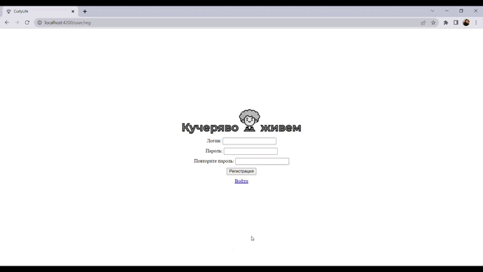
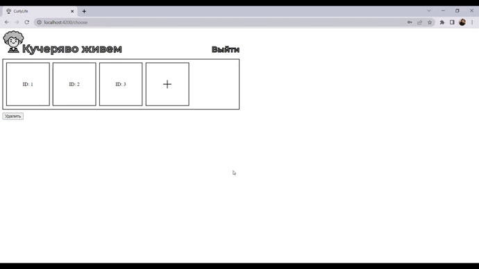
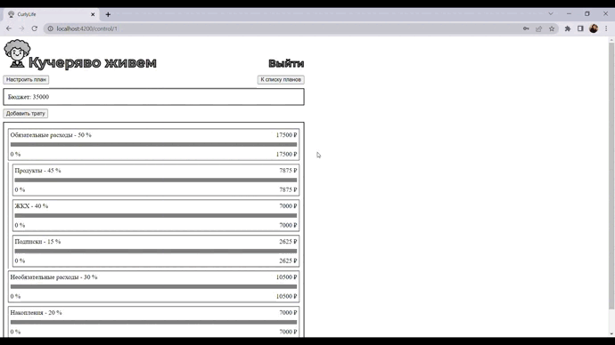
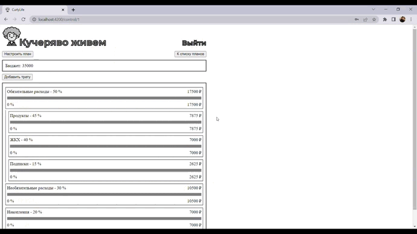

<h1 align="center">Кучеряво живем</h1>

---

<p align="center">
    
</p>

---

## Описание

Кучеряво живем - сервис для контроля своих расходов по персональному финансовому плану

План делит бюджет на блоки с процентом - долей от всего бюджета.

Сумма средств, отведенная на блок считается по формуле `(процент / 100) * бюджет на месяц`.

Блоки плана могут быть детализированы - разбиты на подблоки. К примеру, блок “обязательные траты” может быть поделен на
“ЖКХ”, “транспорт”, “питание” с различными процентами. Доля подблоков высчитывается относительно суммы выделенной на
блок, к которому они относятся.

[ТЗ проекта](https://mica-polyester-67b.notion.site/41cc501f33ba4602bde612ea3618c543)

[Макет в Figma](https://www.figma.com/proto/RtngiqvSYKLCl5fPUU9P8b/Curly-Life?node-id=103%3A448&scaling=scale-down-width&page-id=0%3A1&starting-point-node-id=103%3A448)

## Демонстрация

### Регистрация и аутентификация



### Выбор плана



### Управление расходами



### Конструктор планов



## О проекте

Структура проекта:

- __src__ _- директория с основным кодом приложения и ассетами_
    - __app__ _- директория с кодом приложения_
        - __user-module__ _- модуль, ответственный за регистрацию и аутентификацию_
        - __choose-plan-module__ _- модуль выбора одного из планов пользователя_
        - __costs-control-module__ _- модуль контроля за расходами, с возможностью добавления расходов_
        - __constructor-module__ _- модуль, позволяющий кастомизировать план_
        - __shared__ _- модуль с компонентами, использующимися в нескольких модулях_
        - __models__ _- директория с моделями для различных элементов плана_
        - __services__ _- сервисы, к которым могут обращаться разные модули приложения_
        - __directives__ _- директивы_
        - __pipes__ _- пайпы_
        - __guards__ _- "защитники", ограничивающие доступ к модулям_
    - __assets__ _-_ картинки и другие статические элементы приложения
- __db.json__ _- база данных - затычка, имитирующая бекэнд_

## Запуск

Frontend:
```
npm i
ng serve
```

Backend:
```
npm i
json-server --watch db.json
```
